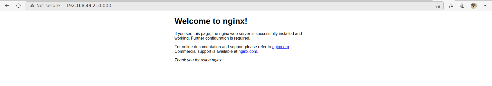

# Kubernetes Lab3

1- How many DaemonSets are created in the cluster in all namespaces?

```bash
amir@amir-Alienware-x15-R1:~/KubernetesLabs/KubernetesLabsITI/Lab3$ kubectl get DaemonSets --all-namespaces
NAMESPACE     NAME         DESIRED   CURRENT   READY   UP-TO-DATE   AVAILABLE   NODE SELECTOR            AGE
kube-system   kube-proxy   1         1         1       1            1           kubernetes.io/os=linux   47h
```
2- what DaemonSets exist on the kube-system namespace?

```bash
NAMESPACE     NAME       
kube-system   kube-proxy   
```

3- What is the image used by the POD deployed by the kube-proxy
DaemonSet ?
```bash
NAMESPACE     NAME                 NODE SELECTOR
kube-system   kube-proxy           kubernetes.io/os=linux 
```
4- Deploy a DaemonSet for FluentD Logging. Use the given
specifications.
Name: elasticsearch
Namespace: kube-system
Image: k8s.gcr.io/fluentd-elasticsearch:1.20

```yaml
apiVersion: apps/v1
kind: DaemonSet
metadata:
  name: elasticsearch
  namespace: kube-system
  labels:
    app: fluentd

spec:
  selector:
    matchLabels:
      app: fluentd-logging

  template:
    metadata:
      name: fluentd-pod
      labels:
        app: fluentd-logging

    spec:

      containers:
        - name : elasticsearch
          image: k8s.gcr.io/fluentd-elasticsearch:1.20

          resources:
            limits:
              memory : "256Mi"
              cpu: "1"
            requests:
              memory : "200Mi"
              cpu: ".5"
```

5- Deploy a pod named nginx-pod using the nginx:alpine image with
the labels set to tier=backend.

```yaml
apiVersion: v1
kind: Pod
metadata:
  name: NginxPod
  labels:
    tier: backend


spec:
  containers:
    - name: NginxContainer
      image: nginx:alpine
```

```bash
amir@amir-Alienware-x15-R1:~/KubernetesLabs/KubernetesLabsITI/Lab3$ kubectl create -f nginx.yaml 
pod/nginx-pod created
```
6- Deploy a test pod using the nginx:alpine image.
```yaml
apiVersion: v1
kind: Pod
metadata:
  name: nginx-test

spec:
  containers:
  - name: nginx-test-container
    image: nginx:alpine
```
```bash
amir@amir-Alienware-x15-R1:~/KubernetesLabs/KubernetesLabsITI/Lab3$ kubectl create -f nginx-test.yaml 
pod/nginx-test created
```
7- Create a service backend-service to expose the backend
application within the cluster on port 80.
```yamlash
apiVersion: v1
kind: Service
metadata:
  name: nginx-pod
  labels:
    tier: backend

spec:
  type: ClusterIP
  ports:
    - targetPort : 80
      port: 80


  selector:
    tier: backend
```
```bash
amir@amir-Alienware-x15-R1:~/KubernetesLabs/KubernetesLabsITI/Lab3$ kubectl create -f service-backend.yml 
service/nginx-pod created
amir@amir-Alienware-x15-R1:~/KubernetesLabs/KubernetesLabsITI/Lab3$ kubectl get all
NAME             READY   STATUS    RESTARTS   AGE
pod/nginx-pod    1/1     Running   0          14m
pod/nginx-test   1/1     Running   0          10m

NAME                 TYPE        CLUSTER-IP       EXTERNAL-IP   PORT(S)   AGE
service/kubernetes   ClusterIP   10.96.0.1        <none>        443/TCP   2d
service/nginx-pod    ClusterIP   10.107.159.250   <none>        80/TCP    11s
```

8- try to curl the backend-service from the test pod. What is the response?

```bash
amir@amir-Alienware-x15-R1:~/KubernetesLabs/KubernetesLabsITI/Lab3$ kubectl exec -it nginx-test -- sh
/ # curl http://nginx-pod
<!DOCTYPE html>
<html>
<head>
<title>Welcome to nginx!</title>
<style>
html { color-scheme: light dark; }
body { width: 35em; margin: 0 auto;
font-family: Tahoma, Verdana, Arial, sans-serif; }
</style>
</head>
<body>
<h1>Welcome to nginx!</h1>
<p>If you see this page, the nginx web server is successfully installed and
working. Further configuration is required.</p>

<p>For online documentation and support please refer to
<a href="http://nginx.org/">nginx.org</a>.<br/>
Commercial support is available at
<a href="http://nginx.com/">nginx.com</a>.</p>

<p><em>Thank you for using nginx.</em></p>
</body>
</html>
/ # 
```

9- Create a deployment named web-app using the image nginx with 2
replicas
```yaml

apiVersion: apps/v1
kind: Deployment
metadata:
  name: web-app
  labels:
    app: web-app

spec:
  replicas: 2
  selector:
    matchLabels:
      app: web-app

  template:
    metadata:
      name: web-app-pod
      labels:
        app: web-app

    spec:
      containers:
         - name: nginx1
           image: nginx
```

10- Expose the web-app as service web-app-service application on
port 80 and nodeport 30082 on the nodes on the cluster

```yaml
apiVersion: v1
kind: Service
metadata:
  name: web-app
  labels:
    app: web-app

spec:
  type: NodePort
  ports:
    - targetPort : 80
      port: 80
      nodePort: 30003

  selector:
    app: web-app
```
11- access the web app from the node
```bash
amir@amir-Alienware-x15-R1:~/KubernetesLabs/KubernetesLabsITI/Lab3$ kubectl exec -it web-app-559756d5f5-r5fvp -- sh
# ls
bin  boot  dev  docker-entrypoint.d  docker-entrypoint.sh  etc  home  lib  lib64  media  mnt  opt  proc  root  run  sbin  srv  sys  tmp  usr  var
# curl http://web-app
<!DOCTYPE html>
<html>
<head>
<title>Welcome to nginx!</title>
<style>
html { color-scheme: light dark; }
body { width: 35em; margin: 0 auto;
font-family: Tahoma, Verdana, Arial, sans-serif; }
</style>
</head>
<body>
<h1>Welcome to nginx!</h1>
<p>If you see this page, the nginx web server is successfully installed and
working. Further configuration is required.</p>

<p>For online documentation and support please refer to
<a href="http://nginx.org/">nginx.org</a>.<br/>
Commercial support is available at
<a href="http://nginx.com/">nginx.com</a>.</p>

<p><em>Thank you for using nginx.</em></p>
</body>
</html>
# 
```


12- How many static pods exist in this cluster in all namespaces?
```bash
amir@amir-Alienware-x15-R1:~/KubernetesLabs/KubernetesLabsITI/Lab3$ kubectl get pods --all-namespaces
NAMESPACE     NAME                               READY   STATUS    RESTARTS        AGE
default       nginx-pod                          1/1     Running   0               73m
default       nginx-test                         1/1     Running   0               69m
default       web-app-559756d5f5-r5fvp           1/1     Running   0               14m
default       web-app-559756d5f5-xs9jd           1/1     Running   0               14m
finance       beta-697dfdc767-982gz              1/1     Running   1 (4h45m ago)   14h
finance       beta-697dfdc767-z87xq              1/1     Running   1 (4h45m ago)   14h
kube-system   coredns-64897985d-82h4w            1/1     Running   3 (4h45m ago)   2d1h
kube-system   elasticsearch-jx749                1/1     Running   0               89m
#kube-system   etcd-minikube                      1/1     Running   3 (4h45m ago)   2d1h
#kube-system   kube-apiserver-minikube            1/1     Running   3 (4h45m ago)   2d1h
#kube-system   kube-controller-manager-minikube   1/1     Running   3 (4h45m ago)   2d1h
kube-system   kube-proxy-rjwvs                   1/1     Running   3 (4h45m ago)   2d1h
#kube-system   kube-scheduler-minikube            1/1     Running   3 (4h45m ago)   2d1h
kube-system   storage-provisioner                1/1     Running   6 (4h45m ago)   2d1h
```
The ones hashed are static pods

Another way:
```bash
amir@amir-Alienware-x15-R1:~/KubernetesLabs/KubernetesLabsITI/Lab3$ minikube ssh
docker@minikube:~$ ls /etc/kubernetes/manifests
etcd.yaml  kube-apiserver.yaml  kube-controller-manager.yaml  kube-scheduler.yaml
```


13-On which nodes are the static pods created currently?
- minikube